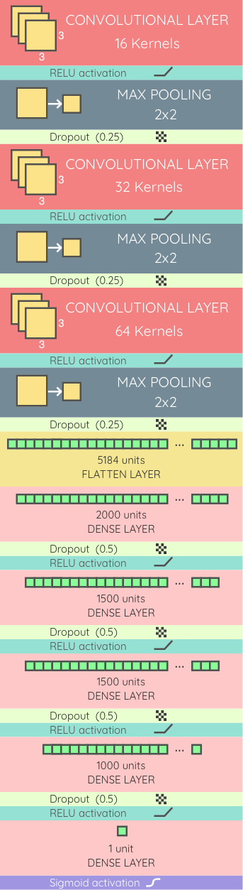

# Deep learning example (WIP) for gender recognition based on hands

lessDataset_bregy folder contain a 1% sampled and resized images from
<a href="https://sites.google.com/view/11khands">11K Hands</a> study.

The current state of this repository is Work in progress, if you want to test
and hack this model you can see the ipython notebook named Modeling.ipynb

